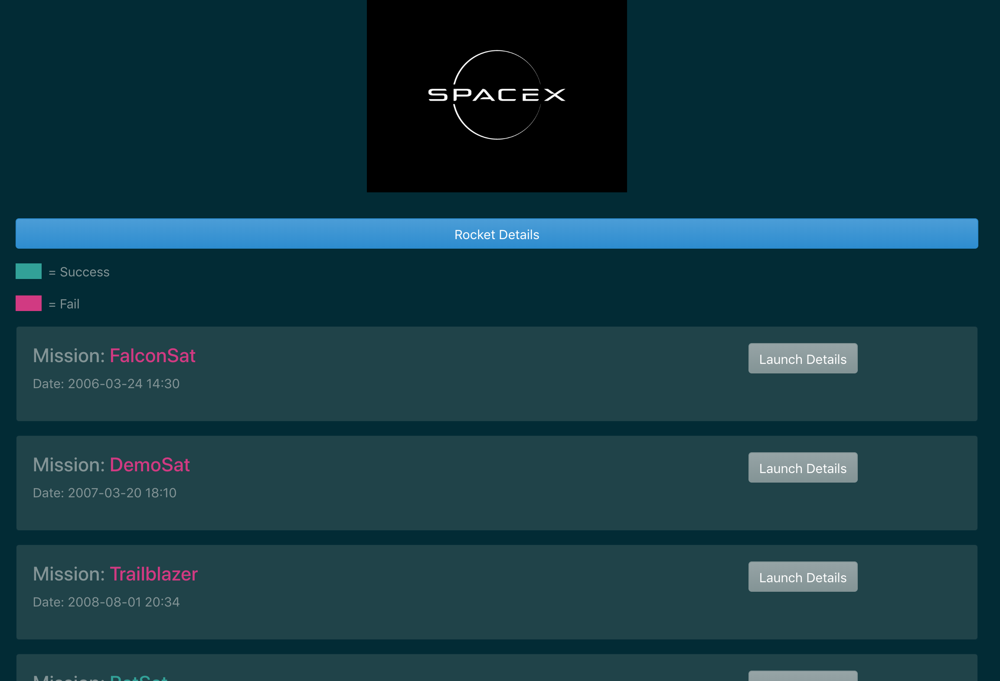

# Project Title

Space X with React+Apollo+GraphQL

## Preview



## Descriptioin

This project extend the [tutorial](https://www.youtube.com/watch?v=SEMTj8w04Z8) sample which created by Traversy Media on Youtube. Thanks!

Some major differences include graphql schema, hooks from react apollo library, Route and theme style.

## Purpose

To learn the GraphQL and Apollo

### Required Skills

React, React Route, Node Express, Axios, ES6, API 

### Download

A step by step series of examples that tell you how to get a development env running

Say what the step will be

```
git clone https://github.com/zhenyu0519/graphql_app.git
```

And navigate to the root folder, install for node

```
npm install
```

Then navigate to the client folder and install for the react

```
npm install
```

## Running the local server

```
npm run dev
```
This will start express sever for back end and run react for front end as well

The scirpt in package.json is like below

Use [Concurrently](https://www.npmjs.com/package/concurrently) to run both script at same time
```
    "server": "nodemon server.js",
    "client": "npm start --prefix client",
    "dev": "concurrently \"npm run server\" \"npm run client\""
```

### JavaScript Libraries
- [classnames](https://www.npmjs.com/package/classnames): A simple JavaScript utility for conditionally joining classNames together.
- [moment](https://www.npmjs.com/package/moment): A lightweight JavaScript date library for parsing, validating, manipulating, and formatting dates.

### Theme
[Bootswatch](https://bootswatch.com/) is free open source community for bootstrap css. Thanks!


### And coding style tests

Explain what these tests test and why

```
Give an example
```

## Authors
Jeffrey Zhang

[LinkIn](https://www.linkedin.com/in/zhenyu-zhang/)

[Github Pages](https://zhenyu0519.github.io)

## License
MIT
